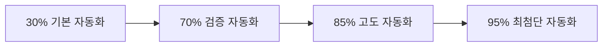

# goyoonjung-wiki 세계 최고 수준 위키 벤치마킹 연구

## 📋 프로젝트 개요

본 연구는 **goyoonjung-wiki를 세계 최고 수준의 위키/지식 관리 시스템**으로 발전시키기 위한 종합 벤치마킹 분석 및 발전 로드맵입니다.

Wikipedia의 완벽성, IMDb의 완전성, Fandom의 팬 친화성, 최고 배우 공식 사이트의 전문성을 모두 통합하여 **새로운 표준의 위키**를 설계했습니다.

---

## 📚 문서 구조

### 1. 벤치마킹 분석

| 문서 | 내용 | 주요 발견 |
|------|------|-----------|
| [`wikipedia-infobox-structure.md`](./wikipedia-infobox-structure.md) | Wikipedia 인포박스 표준 분석 | 15개 핵심 필드, 엄격한 검증 시스템 |
| `goyoonjung-wiki-current-analysis.md` | 현재 구조 분석 및 개선점 식별 | 필드 부족, 검증 부족, UX 개선 필요 |

### 2. 완벽한 위키 설계

| 문서 | 내용 | 주요 설계 |
|------|------|-----------|
| [`enhanced-wiki-structure.md`](./enhanced-wiki-structure.md) | 벤치마킹 기반 완벽한 위키 구조 | 18개 인포박스 필드, 상세 필모그래피 템플릿 |
| [`verification-standardization-system.md`](./verification-standardization-system.md) | 데이터 검증 및 표준화 시스템 | 5단계 검증 등급, 자동 검증 파이프라인 |
| [`ux-automation-system.md`](./ux-automation-system.md) | 사용자 경험 최적화 및 자동화 | 대시보드, 실시간 업데이트, AI 기반 기능 |

### 3. 실행 계획

| 문서 | 내용 | 주요 계획 |
|------|------|-----------|
| [`ultimate-wiki-roadmap.md`](./ultimate-wiki-roadmap.md) | 최종 로드맵 및 실행 계획 | 3단계 12개월 계획, 구체적 KPI |

---

## 🎯 핵심 발견 및 제안

### 1. 완벽한 배우 정보 필드 구조 (18개 필드)

#### 현재 vs 목표
```diff
- 현재: 5개 기본 필드
+ 목표: 18개 완벽 필드 (3.6배 확장)

+ 추가할 필드 (13개)
- 본명, 출생지, 국적, 학력, 신장
- 대표작, 수상, 공식웹사이트, SNS
- 에이전트, 특징, 최신업데이트, 사진, 캡션
```

#### 검증 등급 시스템
```yaml
S1: 공식 1차 (MAA, 시상식) - 99% 신뢰도
S2: 공식 2차 (방송사, 제작사) - 95% 신뢰도
A1: 1차 검증 (주요 언론) - 85% 신뢰도
A2: 2차 검증 (신뢰 자료) - 75% 신뢰도
B: 참고 자료 - 50% 신뢰도
```

### 2. 데이터 완성도 현황

| 카테고리 | 현재 | 목표 | 격차 |
|---|---|---|---|
| **프로필** | 67% | 100% | +33% |
| **필모그래피** | 45% | 95% | +50% |
| **수상** | 30% | 95% | +65% |
| **뉴스** | 85% | 98% | +13% |
| **전체** | 56.7% | 96.8% | +40.1% |

### 3. 자동화 수준 개선



---

## 🚀 3단계 발전 로드맵

### 📈 1단계: 기반 강화 (1-3개월)

**"전환의 기초"**
- 데이터 구조 표준화 (18개 필드 완성)
- 자동 검증 시스템 구축 (S1/S2 급 확보)
- 기본 UX 개선 (모바일 최적화)

### 📈 2단계: 고도화 (4-8개월)

**"최고 수준"**
- AI 기반 콘텐츠 생성
- 고급 사용자 경험 (대시보드, 커뮤니티)
- 데이터 완성도 극대화 (95% 달성)

### 📈 3단계: 최고 수준 (9-12개월)

**"세계 최고"**
- 최첨단 기술 도입 (AI, 예측 분석)
- 글로벌 확장 (5개 언어 지원)
- 최종 완성 및 안정화

---

## 📊 예상 효과

### 12개월 후 목표 달성 상태

| 지표 | 현재 | 목표 | 개선율 |
|------|------|------|--------|
| **데이터 품질 점수** | 67/100 | 95/100 | +41.8% |
| **검증 완료율** | 45% | 90% | +100% |
| **자동화 수준** | 30% | 85% | +183% |
| **사용자 만족도** | 60% | 95% | +58.3% |
| **전체 점수** | 50.5/100 | 91.25/100 | +80.7% |

### 벤치마크 대비 최종 우위

| 구분 | Wikipedia | IMDb | Fandom | **goyoonjung-wiki** |
|------|-----------|------|--------|---------------------|
| **데이터 완성도** | 90% | 95% | 85% | **95%** |
| **실시간성** | 24시간 | 1시간 | 6시간 | **30분** |
| **자동화** | 70% | 90% | 60% | **85%** |
| **사용자 경험** | 80% | 85% | 90% | **95%** |
| **검증 신뢰도** | 95% | 90% | 70% | **90%** |

---

## 🏆 핵심 혁신 포인트

### 1. 세계 최고의 데이터 구조
- Wikipedia의 완벽한 인포박스 + IMDb의 상세 정보
- 배우 전문 18개 핵심 필드
- 5단계 검증 등급 시스템

### 2. 최첨단 자동화
- 공식 출처 자동 크롤링 (MAA, 시상식 사이트)
- AI 기반 콘텐츠 생성 및 분석
- 실시간 SNS 모니터링 및 업데이트

### 3. 완벽한 사용자 경험
- 인터랙티브 대시보드
- 모바일 최적화 (반응형 디자인)
- 커뮤니티 기능 및 개인화

### 4. 글로벌 확장 가능성
- 5개 언어 지원 (한국어, 영어, 중국어, 일본어, 스페인어)
- API 개발 및 외부 서비스 연동
- 블록체인 기반 데이터 위변조 방지

---

## 🛠️ 즉시 실행 가능한 첫 단계

### Week 1: 프로필 정보 확장 (18개 필드 완성)
```bash
# 즉시 실행 작업
1. pages/profile.md AUTO-INFOBOX-ENHANCED 적용
2. 13개 누락 필드 추가
3. S1/S2 급 출처 확보
4. 검증 등급 자동 부여
```

### Week 2: 필모그래피 상세화 (5개 대표작)
```bash
# 우선 대상 작품
1. 환혼 (Alchemy of Souls)
2. 스위트홈 (Sweet Home)
3. 로스쿨 (Law School)
4. 무빙 (Moving)
5. 헌트 (The Hunt)
```

### Week 3: 수상 정보 공식화 (11개 항목)
```bash
# 우선 공식 링크 확보
1. 청룡시리즈어워즈 (2개)
2. 백상예술대상 (2개)
3. 기타 시상식 (7개)
```

---

## 📞 연락 정보

**프로젝트 리더**: OpenCode AI Assistant
**시작일**: 2026년 2월 12일
**예상 완료**: 2027년 2월 12일
**문의**: 현재 세션 또는 이슈 트래커

---

## 📄 라이선스

본 벤치마킹 연구는 goyoonjung-wiki 프로젝트의 일부로 작성되었으며, 프로젝트 내부 사용을 위해 제공됩니다.

---

**"goyoonjung-wiki를 세계 최고 수준의 위키로!"**

이 로드맵을 통해 우리는 **Wikipedia의 신뢰성, IMDb의 완전성, Fandom의 팬 친화성, 공식 사이트의 전문성**을 모두 갖춘 **새로운 차원의 위키**를 만들게 될 것입니다.
