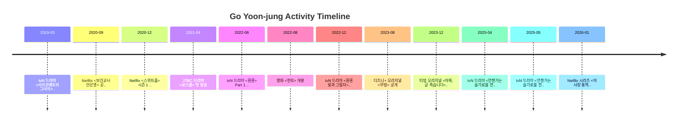

# Activity Timeline
> Auto-generated from schedule.md

## 공식 링크
- (내부) schedule.md: schedule.md
- (S) 소속사(MAA) 프로필(공식 필모/커버리지 기준): https://maa.co.kr/artists/go-younjung

## 출처
- (내부) pages/schedule.md (타임라인 생성 원본)
- (S/A) 각 일정 항목의 `링크(공식/원문)`

[Back to Schedule](schedule.md)
