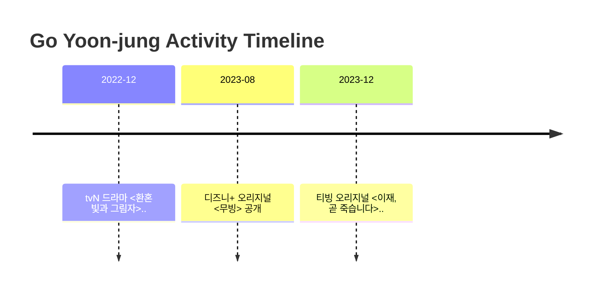

# Activity Timeline
> Auto-generated from schedule.md

<!-- AUTO-TIMELINE-NARRATIVE:START -->
## 🧾 연도별 요약(자동 · 서술형)
> 메모: 위키백과처럼 ‘읽는 타임라인’ 느낌을 만들기 위한 자동 요약입니다. (추측/평가 없음)

- 2019: 드라마/영화 활동: 사이코메트리 그녀석(tvN)

- 2020: 드라마/영화 활동: 보건교사 안은영(Netflix), 스위트홈(Netflix)

- 2021: 드라마/영화 활동: 로스쿨(JTBC)

- 2022: 드라마/영화 활동: 환혼(tvN), 환혼 빛과 그림자(tvN), 헌트(영화)
  - 수상/노미네이트 기록: 부일영화상(후보), 대종상(후보) 외

- 2023: 드라마/영화 활동: 무빙(Disney+), 이재, 곧 죽습니다(TVING)
  - 수상/노미네이트 기록: 백상예술대상(영화)(후보), 아시아콘텐츠어워즈 & 글로벌OTT어워즈(수상) 외

- 2024: (기록 보강 중)
  - 수상/노미네이트 기록: 청룡시리즈어워즈(수상), 백상예술대상(TV)(후보)

- 2025: 드라마/영화 활동: 언젠가는 슬기로울 전공의생활(tvN)
  - 수상/노미네이트 기록: 대한민국 대중문화예술상(수상), 코리아 드라마 어워즈(후보)

<!-- AUTO-TIMELINE-NARRATIVE:END -->

[Back to Schedule](schedule.md)
