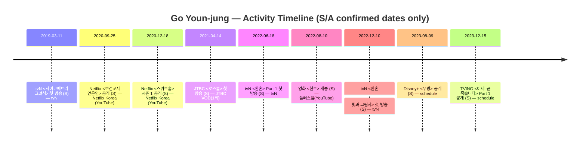

# 🧭 타임라인 (Timeline)

> 원칙: **링크 중심(저작권 안전)** + **근거 수준(S/A/2차/보강 필요)** 표기.
> 이 페이지는 “연도 흐름”을 빠르게 훑기 위한 **요약 타임라인**입니다.

- 작품 목차: [`pages/works-characters.md`](works-characters.md)
- 날짜 근거(공식/원문): [`pages/schedule.md`](schedule.md)

---

## 한눈에 보기 (Mermaid)

---

## 연도별 요약

### 2026
- (보강 필요) tvN <언젠가는 슬기로울 전공의생활> **공식 페이지 확인됨** (방영/공개일은 페이지 내 표기 확인 후 날짜 보강)
  - 링크(공식/원문, S): <https://tvn.cjenm.com/ko/resident-playbook/>
  - 관련 문서: [`works/resident-playbook.md`](works/resident-playbook.md)

### 2023
- 2023-12-15 — TVING 오리지널 **<이재, 곧 죽습니다> Part 1 공개** (S)
  - 근거: [`schedule.md`](schedule.md)
  - 관련 문서: [`works/deaths-game.md`](works/deaths-game.md)
- 2023-08-09 — Disney+ 오리지널 **<무빙> 공개** (S)
  - 근거: [`schedule.md`](schedule.md)
  - 관련 문서: [`works/moving.md`](works/moving.md)
- (공개일 미정) — Netflix **<이 사랑 통역 되나요?>** (S: 작품 페이지 확인, 날짜 보강 필요)
  - 링크(공식/원문): <https://www.netflix.com/title/81697769>
  - 관련 문서: [`works/can-this-love-be-translated.md`](works/can-this-love-be-translated.md)

### 2022
- 2022-12-10 — tvN 드라마 **<환혼: 빛과 그림자> 첫 방송** (S)
  - 근거: tvN 프로그램 페이지 표기
  - 링크(공식/원문): <https://tvn.cjenm.com/ko/alchemyofsouls/>
- 2022-08-10 — 영화 **<헌트> 개봉** (S)
  - 근거: 배급사(플러스엠 엔터테인먼트) 공식 예고편 설명란 “8월10일 대개봉”
  - 링크(공식/원문): <https://www.youtube.com/watch?v=CSOb8gia_mg>
- 2022-06-18 — tvN 드라마 **<환혼> (Part 1) 첫 방송** (S)
  - 근거: tvN 프로그램 페이지 표기
  - 링크(공식/원문): <https://tvn.cjenm.com/ko/hhw1_test/>

### 2021
- 2021-04-14 — JTBC 드라마 **<로스쿨> 첫 방송** (S)
  - 근거: JTBC 1회 다시보기 페이지 “2021.04.14 (Wed) 21:00 방송”
  - 링크(공식/원문): <https://tv.jtbc.co.kr/replay/pr10011289/pm10062037/ep20125473/view>

### 2020
- 2020-12-18 — Netflix **<스위트홈> 시즌 1 공개** (S)
  - 근거: Netflix Korea 공식 채널 예고편 설명란 “12월 18일, 오직 넷플릭스에서”
  - 링크(공식/원문): <https://www.youtube.com/watch?v=B5IQqZDSRjk>
- 2020-09-25 — Netflix **<보건교사 안은영> 공개** (S)
  - 근거: Netflix Korea 공식 채널 예고편 설명란 “9월 25일, 오직 넷플릭스에서”
  - 링크(공식/원문): <https://www.youtube.com/watch?v=Nc2t2oCMkxU>

### 2019
- 2019-03-11 — tvN 드라마 **<사이코메트리 그녀석> 첫 방송** (S)
  - 근거: tvN 프로그램 페이지 표기(2019.03.11 ~ 2019.04.30)
  - 링크(공식/원문): <https://tvn.cjenm.com/ko/heispsychometric/>

---

## 보강 대기(작품 페이지는 있으나 ‘날짜 확정’이 아직)

아래는 작품 페이지는 존재하지만, **공개/첫방/개봉 등 날짜를 S/A급(공식/원문)으로 확정**해 `schedule.md`에 등록하기 전이라,
이 페이지의 타임라인(날짜 라인)에는 아직 넣지 않았습니다.

- <보건교사 안은영> / <스위트홈>은 공개일을 이번에 **Netflix Korea 공식 예고편 설명란**으로 S급 확정 처리 완료.
- 아래 항목들은 추가 보강 필요:
  - (확인 필요) <사이코메트리 그녀석> 외 작품들 중, tvN/JTBC/플랫폼 공식 페이지에서 YYYY-MM-DD가 명시되는지 점검

> 다음 액션(추천): 각 작품 페이지(`pages/works/*.md`)에 공식 링크를 먼저 채우고 → `schedule.md`에 날짜 확정 → 여기(타임라인)에 반영.
