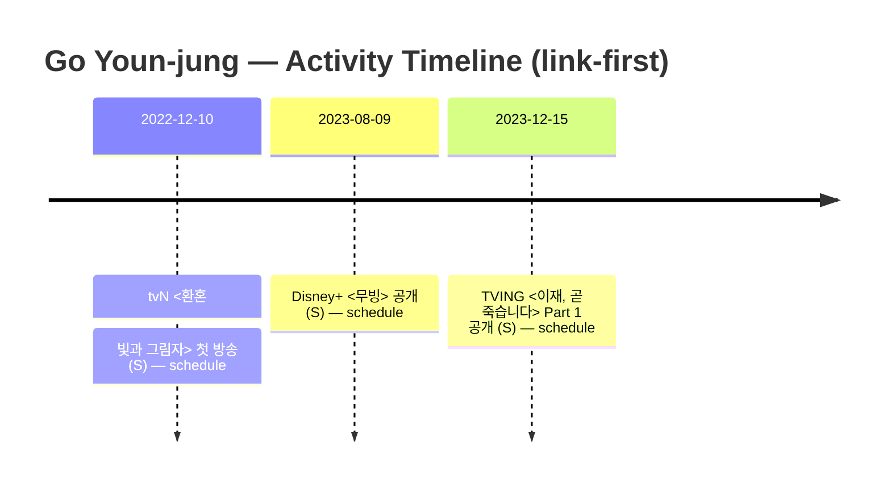

# 🧭 타임라인 (Timeline)

> 원칙: **링크 중심(저작권 안전)** + **근거 수준(S/A/2차/보강 필요)** 표기.
> 이 페이지는 “연도 흐름”을 빠르게 훑기 위한 **요약 타임라인**입니다.
> 자세한 링크 박스/자료는 각 작품/항목 페이지로 이동해 주세요.

- 작품 목차: [`pages/works-characters.md`](works-characters.md)
- 공식 일정/공개일 근거: [`pages/schedule.md`](schedule.md)

---

## 한눈에 보기 (Mermaid)

> 위 타임라인에 들어가는 “날짜 확정 이벤트”는 기본적으로 `schedule.md`(공식/원문 링크 포함)에서만 끌어옵니다.

---

## 연도별 요약

### 2026
- (보강 필요) tvN <언젠가는 슬기로울 전공의생활> **공식 페이지 확인됨** (방영/공개일은 페이지 내 표기 확인 후 날짜 보강)
  - 링크(공식/원문, S): <https://tvn.cjenm.com/ko/resident-playbook/>
  - 관련 문서: [`works/resident-playbook.md`](works/resident-playbook.md)

### 2023
- 2023-12-15 — TVING 오리지널 **<이재, 곧 죽습니다> Part 1 공개** (S)
  - 근거: [`schedule.md`](schedule.md)
  - 관련 문서: [`works/deaths-game.md`](works/deaths-game.md)
- 2023-08-09 — Disney+ 오리지널 **<무빙> 공개** (S)
  - 근거: [`schedule.md`](schedule.md)
  - 관련 문서: [`works/moving.md`](works/moving.md)

### 2022
- 2022-12-10 — tvN 드라마 **<환혼: 빛과 그림자> 첫 방송** (S)
  - 근거: [`schedule.md`](schedule.md)
  - 관련 문서: [`works/alchemy-of-souls.md`](works/alchemy-of-souls.md)

---

## 보강 대기(틀만 먼저 잡기)

아래 항목들은 이 위키에 “작품 페이지”는 있으나, **공개/첫방/개봉 등 날짜를 S급(공식/원문)으로 확정해 `schedule.md`에 옮기기 전**이라 타임라인에 날짜로 박기 어렵습니다.

- <사이코메트리 그녀석> → [`works/he-is-psychometric.md`](works/he-is-psychometric.md)
- <보건교사 안은영> → [`works/the-school-nurse-files.md`](works/the-school-nurse-files.md)
- <스위트홈> → [`works/sweethome.md`](works/sweethome.md)
- <로스쿨> → [`works/law-school.md`](works/law-school.md)
- <환혼(Part 1)> → [`works/alchemy-of-souls.md`](works/alchemy-of-souls.md)
- <헌트>(영화) → [`works/hunt.md`](works/hunt.md)
- <이 사랑 통역 되나요?> → [`works/can-this-love-be-translated.md`](works/can-this-love-be-translated.md)

> 다음 액션(추천): 각 작품 페이지에 있는 **공식 페이지/플랫폼 링크**에서 공개일 표기를 확인하고, 확인된 날짜를 `schedule.md`에 S급으로 등록 → 그 다음 이 페이지 타임라인(mermaid/연도별)에도 자동 반영.
